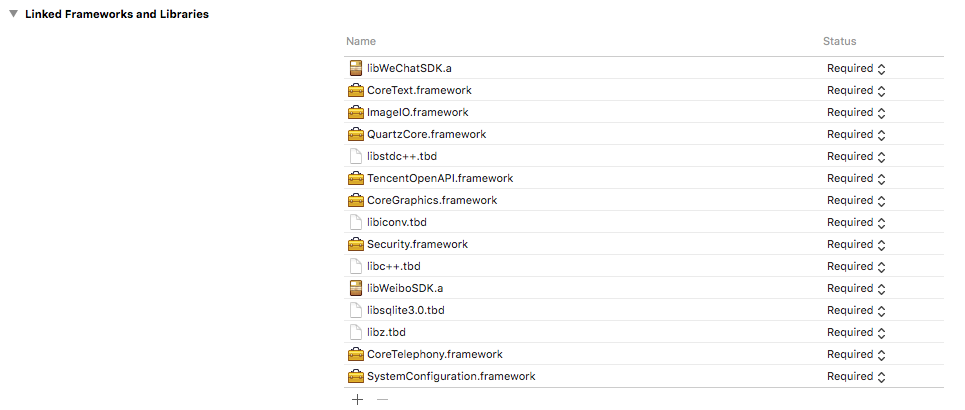
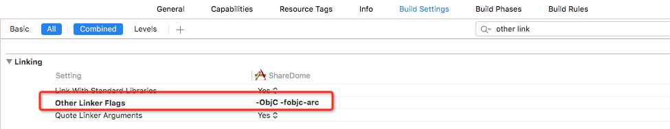
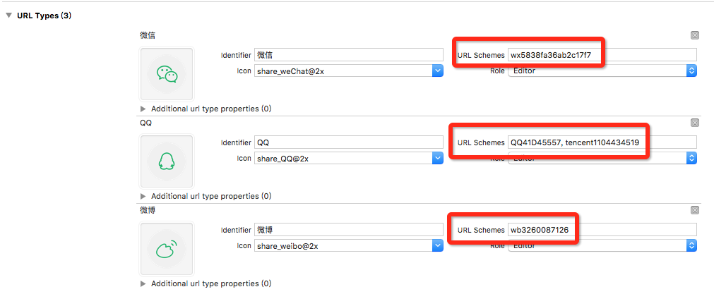

# EMShareSDK

&nbsp;
&nbsp;
&nbsp;
&nbsp;
&nbsp;

集成了微信、QQ和微博的分享与登录SDK，可以拿来直接用

这里写了个Dome，代码文件都在“EMShareSDK”文件夹下

使用时代码量很小

#使用

1.将文件夹"EMShareSDK"导入你的项目中

2.添加如图Framework，你项目已有的就不用添加了

3.修改Build Setting里的Other Linker Flags，如图：

4.添加URL Schemes，需要在第三方的开放平台上申请

5.修改"EMSConfigure.plist"文件里对应的AppKey

6.在"AppDelegate"对应方法中添加注册代码，就3行，Dome中有

7.在需要使用的方法中直接调用

·需要分享功能只需要#import "EMSShareSDK.h"

·需要登录功能只需要#import "EMSLogin.h"

